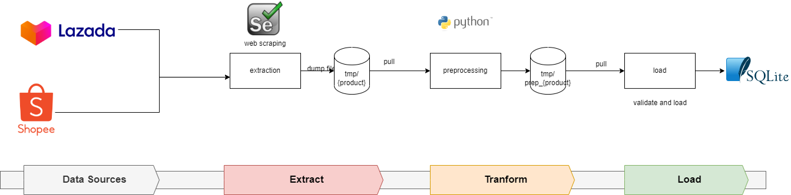

# ETL Product-price Comparing Project
This demo project is a part of the interview assignment and my learning journey, which helped me a lot to learn data engineering processes such as the ETL.
The goal of the project is to collect item product prices and combine together so that can compare the price of each product from each shopping online platform.
The process is to clean these data sets and bring various sources together into one table. I'll have written an ETL pipeline to extract, transform, and load this data into a new database.

## Data sources

- https://www.lazada.co.th/
- https://shopee.co.th/

## Languages and Tools

 
 
 
 
 

## ETL Pipelines

From the overall diagram, the first process is the Extract process which uses a web scraping technic to scrape product information e.g., name, price, store name, sold, rating, specification, and link from lazada and shopee platforms.
Then generate data to data frame format and save to temporary storage (file system) as .csv file.
[full explanation and source code in [1_extract.ipynb](src/1_extract.ipynb)]

Transformation and cleaning data is the second process of ETL, I have dropped some columns that not need in this project and clean some columns such as price and sold in terms of changing data type, cleaning format, dropping missing data, and duplicate data. And then save transformed data to temporary storage (file system) as .csv file
and perform some data visaulization.
[full explanation and source code in [2_transform.ipynb](src/2_transform.ipynb)]

The last process is loading transformed data to the database, I have selected SQLite to be the database destination because is dataset not complex and has little data.
[full explanation and source code in [3_load.ipynb](src/3_load.ipynb)]

## Limitations
- web scraping by selenium in e-commerce online platform, some information is not provided, so have much missing value data.
- scraping items from search keywords, cannot guarantee to get match all exact items needed.